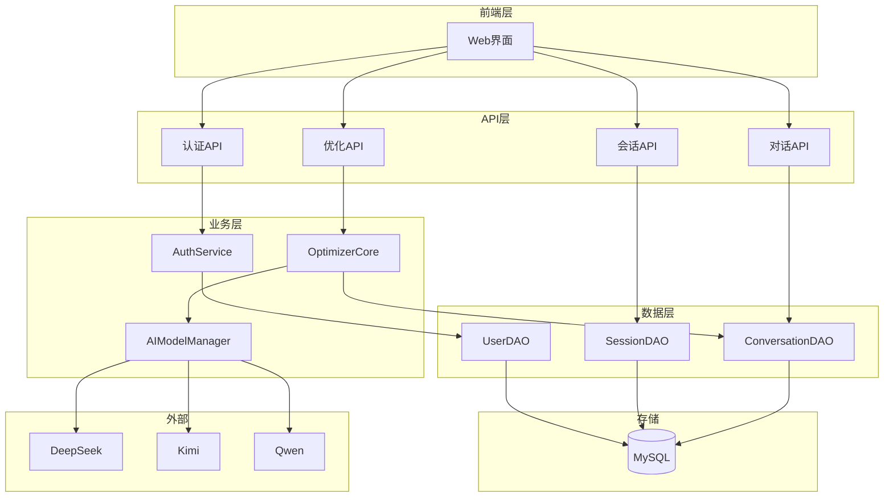
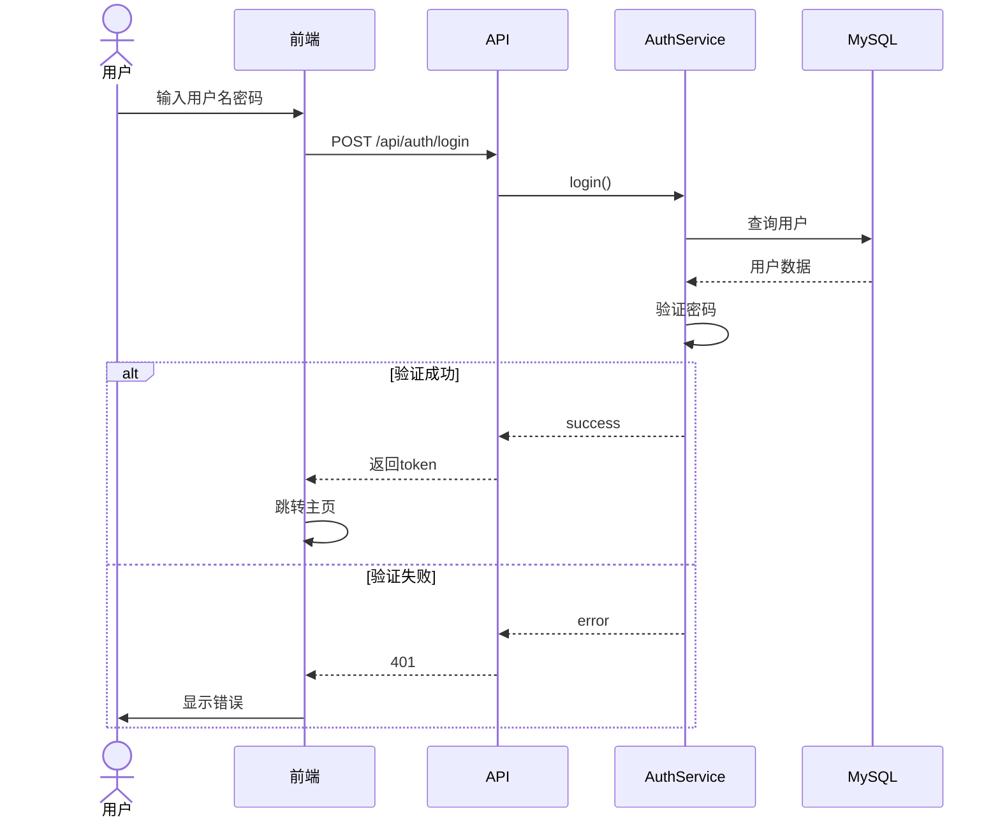
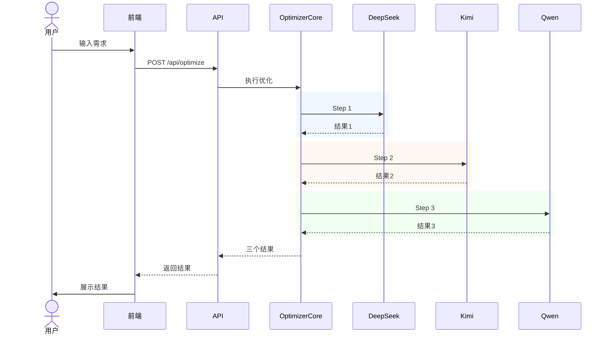
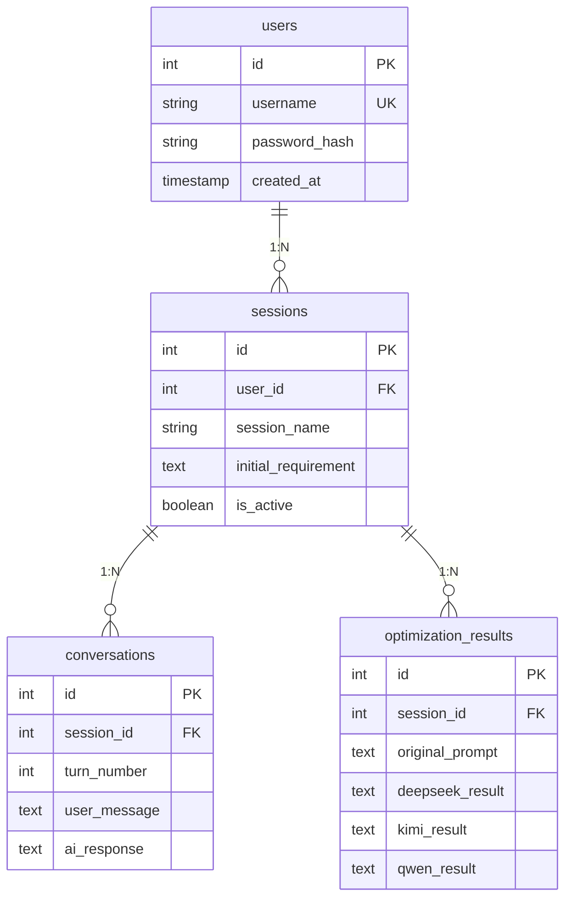

# 提示词优化工具 - 代码架构图

## 一、项目目录结构

```
prompt_optimizer/
├── config/                     # 配置模块
│   ├── __init__.py
│   └── settings.py
├── src/                        # 源代码
│   ├── core/                  # 核心业务逻辑
│   │   ├── optimizer.py
│   │   └── prompt_templates.py
│   ├── models/                # AI模型层
│   │   └── ai_models.py
│   └── utils/                 # 工具层
│       ├── auth.py
│       ├── database.py
│       └── logger.py
├── static/                     # 前端静态文件
│   ├── index.html
│   ├── login.html
│   ├── style.css
│   └── script.js
├── app.py                      # Flask主程序
└── init_db.py                  # 数据库初始化
```

## 二、系统架构图

### 2.1 三层架构

```
┌─────────────────────────────────────────────────────────────┐
│                        表现层 (Presentation)                   │
│  ┌──────────────────────────────────────────────────────┐   │
│  │  Web前端 (HTML/CSS/JavaScript)                        │   │
│  │  - login.html  - index.html                          │   │
│  │  - script.js   - style.css                           │   │
│  └──────────────────────────────────────────────────────┘   │
└─────────────────────────────────────────────────────────────┘
                            ↕ REST API
┌─────────────────────────────────────────────────────────────┐
│                    业务逻辑层 (Business Logic)                 │
│  ┌──────────────────────────────────────────────────────┐   │
│  │  Flask (app.py) - 17个API端点                        │   │
│  └──────────────────────────────────────────────────────┘   │
│  ┌──────────────────────────────────────────────────────┐   │
│  │  核心模块                                             │   │
│  │  - OptimizerCore  - AIModelManager                  │   │
│  │  - AuthService                                       │   │
│  └──────────────────────────────────────────────────────┘   │
└─────────────────────────────────────────────────────────────┘
                            ↕ DAO
┌─────────────────────────────────────────────────────────────┐
│                      数据访问层 (Data Access)                  │
│  ┌──────────────────────────────────────────────────────┐   │
│  │  DAO: UserDAO, SessionDAO, ConversationDAO          │   │
│  └──────────────────────────────────────────────────────┘   │
│  ┌──────────────────────────────────────────────────────┐   │
│  │  MySQL数据库                                          │   │
│  │  users | sessions | conversations | results         │   │
│  └──────────────────────────────────────────────────────┘   │
└─────────────────────────────────────────────────────────────┘
```

### 2.2 组件交互图



## 三、核心流程图

### 3.1 用户登录流程



### 3.2 三模型协作优化流程



### 3.3 数据库表关系


